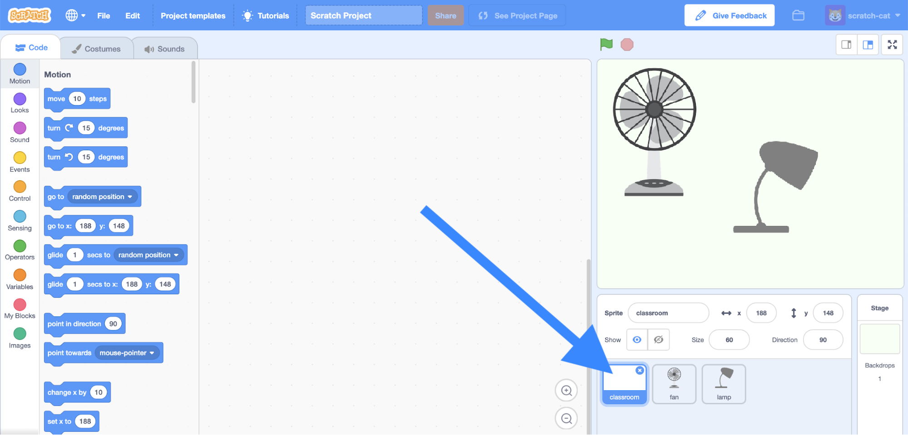
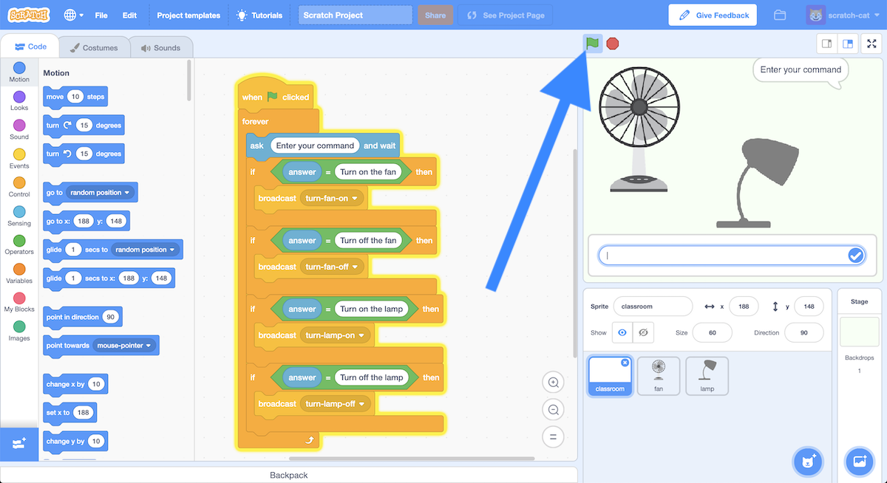

## Using a list of rules

In this step, you will edit the template project to include a list of rules to activate and de-activate the fan and the lamp.

--- task ---
+ Click the “**classroom**” sprite so that it is selected as shown below.


+ Click on the **Scripts** tab and enter the following script. 

```blocks3
when green flag clicked
forever
ask [Enter your command] and wait
if <(answer) = [Turn on the fan]> then
broadcast (turn-fan-on v)
end
if <(answer) = [Turn off the fan]> then
broadcast (turn-fan-off v)
end
if <(answer) = [Turn on the lamp]> then
broadcast (turn-lamp-on v)
end
if <(answer) = [Turn off the lamp]> then
broadcast (turn-lamp-off v)
end
end
```

+ Save your project. Click on **File -> Save to your computer** to save the project to a file.
--- /task ---

--- task ---

+ Click on the **green flag** to test. 


+ Type in a message and watch it react! Try “Turn on the lamp”, “Turn off the lamp”, “Turn on the fan”, and “Turn off the fan”. They should all work. Type anything else, and nothing will happen! Even if you just make a small spelling mistake, it won’t match. 

--- /task ---

You’ve programmed the virtual classroom to react to commands using a simple rules-based approach. 
If you want it to understand commands phrased differently, you would need to add extra **if** blocks.
The problem is you need to predict exactly what command the smart assistant will get. Listing every possible message would take forever. 
Next, we’ll try a better approach: teaching the computer to recognise commands for itself.