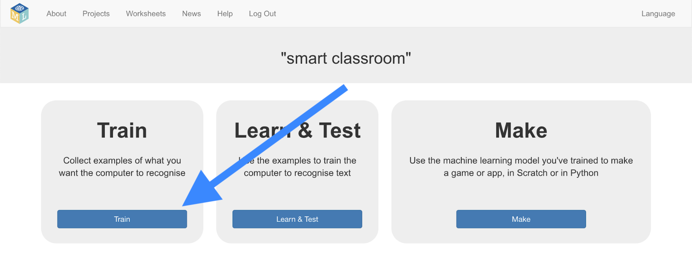
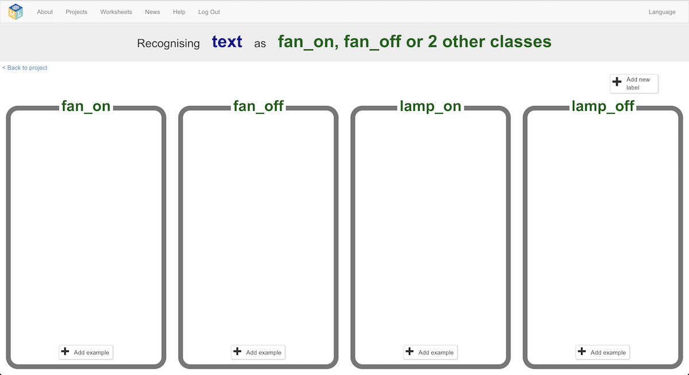
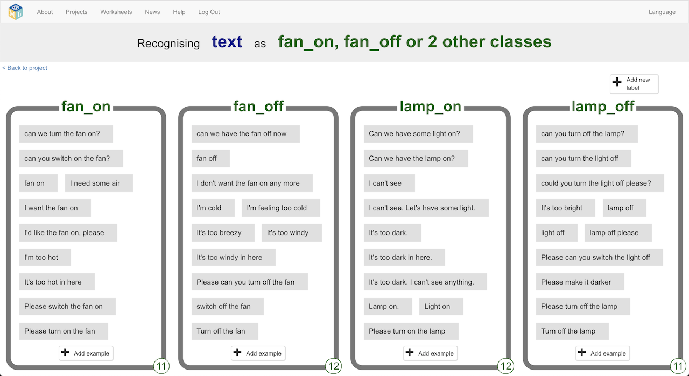

## Collect examples for your machine learning model

--- task ---
+ Close the Scratch window and go back to the Training tool.

+ Click on the **< Back to project** link.
--- /task ---

--- task ---
+ We need to collect some examples to train the computer. Click the **Train** button.

+ Click on **+ Add new label** and call it “fan on”.  Do that again, and create a second bucket called “fan off”. Create a third and fourth called “lamp on” and "lamp off".

+ Click on the **Add example** button in the “fan on” bucket, and type in a way to ask for the fan to be turned on. For example, you could type “Please can you switch on the fan”. 

+ Click on the **Add example** button in the “fan off” bucket, and type in a way to ask for the fan to be switched off. For example, you could type “I want the fan off now”

+ Do the same for the “lamp on” and “lamp off” buckets.
--- /task ---

--- task ---
+ Continue to **Add example**s until you have got at least **six** examples in **each** bucket.

Be imaginative! 
Try and think of lots of different ways to ask each command. 
For “fan on” you could complain that you’re too hot. 
For “fan off” you could complain that it’s too breezy. 
For “lamp on” you could complain that it’s too dark or that you can’t see. 
For “lamp off” you could complain that it’s too bright.

--- /task ---

In the next step you will train your machine to recognise any command and automatically put it in one of the 4 buckets based on the examples you have added.