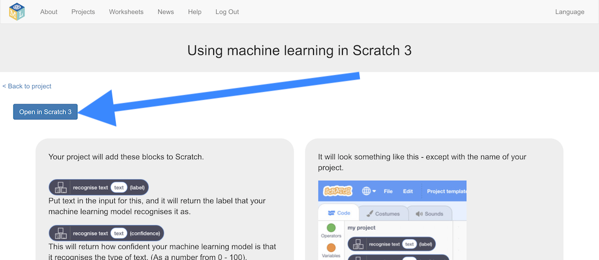
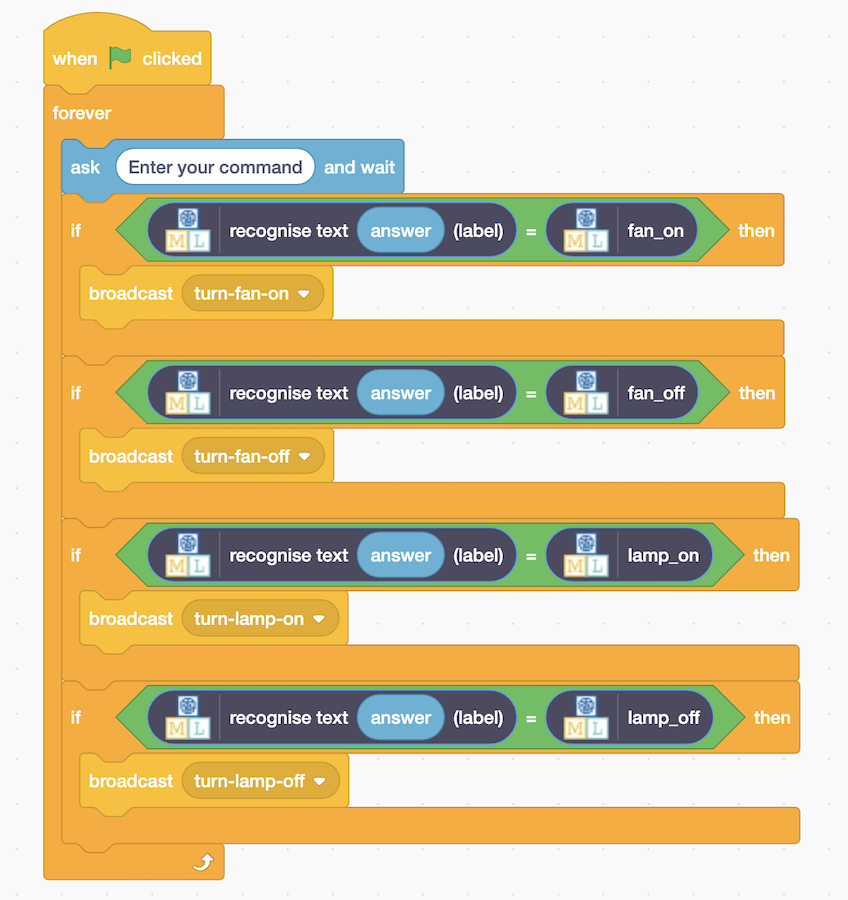

## Using your machine learning model in Scratch

Now you will update your scratch program to include your machine learning model.

--- task ---
+ Click on the **< Back to project** link

+ Click on **Make**

+ Click on **Scratch 3**

+ Click on **Open in Scratch 3** This page has instructions on how to use the new blocks in Scratch

+ Load the Scratch project you saved before.  Click on **File -> Load from your computer** Click OK when it asks to replace the current project
--- /task ---

--- task ---
+ Click on the **Code** tab, and update the script to use your machine learning model **instead** of the rules you made before.
The “recognise text … (label)” block is a new block added by your project. If you give it text, it will return the label for one of the four commands based on the training you’ve given to the computer.

--- /task ---

--- task ---
+ Click the **green flag** to test again.

+ Test your project 
Type a command and press enter. The fan or lamp should react to your instructions. 
Make sure you test that this works **even for messages that you didn’t include in your training.**

+ Save your project.
Click **File -> Save to your computer**
--- /task ---

You’ve modified your Scratch smart classroom assistant to use machine learning instead of your earlier rules-based approach. 
Training the computer to be able to recognise instructions for itself should be much quicker than trying to make a list of every possible command. 
The more examples you give it, the better it should get at recognising instructions correctly.